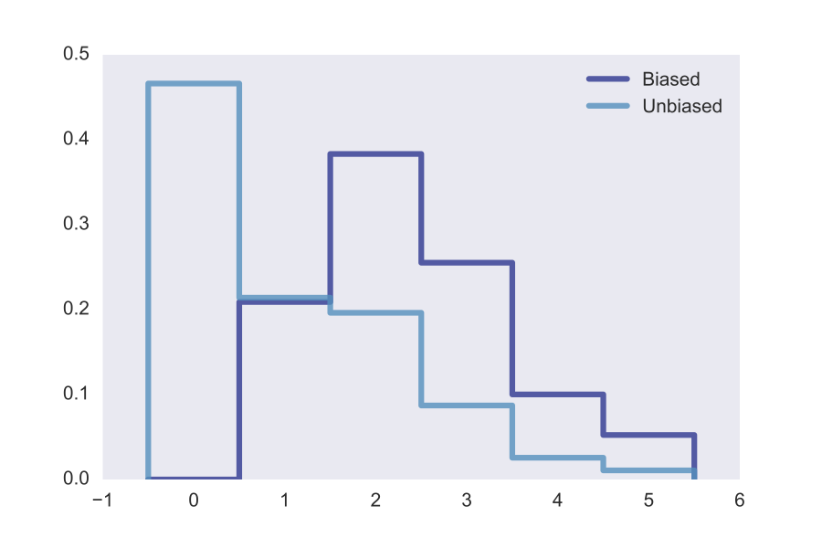

[Think Stats Chapter 3 Exercise 1](http://greenteapress.com/thinkstats2/html/thinkstats2004.html#toc31) (actual vs. biased)

>> The mean of the Unbiased PMF is: 1.02420515504 <br >
The mean of the Biased PMF is: 2.40367910066


```python
import chap01soln
resp = chap01soln.ReadFemResp()
numkdhh = resp['numkdhh']

def pmf(series):
    prob_series = series.value_counts().sort_index() / len(series)
    d = {x : freq for x, freq in prob_series.iteritems()}
    return d
def biaspmf(series):
    d = {}
    prob_series = (series.value_counts().sort_index() / len(series))
    prob_series = prob_series.mul(prob_series.index)
    d = {x : freq for x, freq in prob_series.iteritems()}
    return d

unbias = pmf(numkdhh)
bias = biaspmf(numkdhh)
unique_values = len(bias)
bias_values = list(bias.values())
bias_values.append(0)
shape = list(range(0,7))

fig = plt.figure(figsize=[10,5])
ax = fig.add_subplot(111)
ax.hist(numkdhh, bins=unique_values, range=[0,unique_values], normed=True, histtype='step', align='left',label='Unbias')
ax.step(shape,bias_values,where='mid',label='Unbias')

bias_mean = sum([k*v for k,v in bias.items()])
unbias_mean = sum([k*v for k,v in unbias.items()])

print(unbias_mean,bias_mean)

plt.show()
```


>> By means of ThinkStats2 built in functions


```python
pmf = thinkstats2.Pmf(numkdhh,label='Unbiased')
pmf_biased = probability.BiasPmf(pmf,label='Biased')

thinkplot.preplot(2)
thinkplot.Pmfs([pmf_biased,pmf])
thinkplot.show()

print ("The mean of the Unbiased PMF is: %s" % pmf.Mean(),"The mean of the Biased PMF is: %s" % pmf_biased.Mean(),sep='\n')
```


