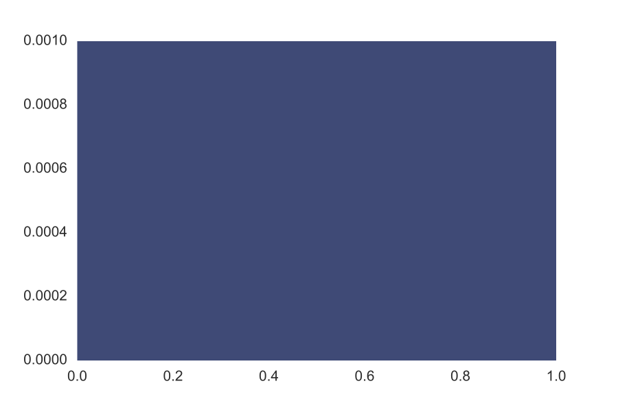
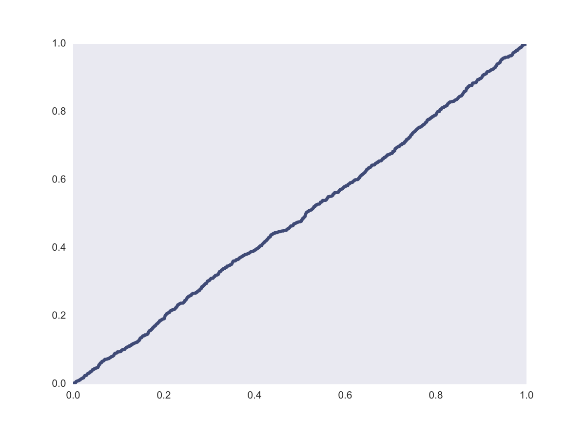

[Think Stats Chapter 4 Exercise 2](http://greenteapress.com/thinkstats2/html/thinkstats2005.html#toc41) (a random distribution)

> The distribution is uniform as seen from the CDF since the slope is constant.


```python
rand = [random.random() for i in range(1000)]
pmf = thinkstats2.Pmf(rand)
thinkplot.Pmf(pmf)
thinkplot.show()
cdf = thinkstats2.Cdf(rand)
thinkplot.Cdf(cdf)
thinkplot.show()
```


>> PMF





>> CDF




