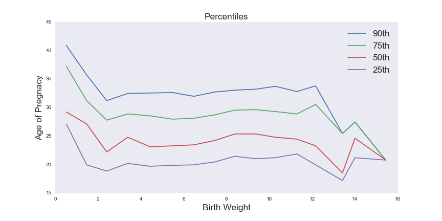
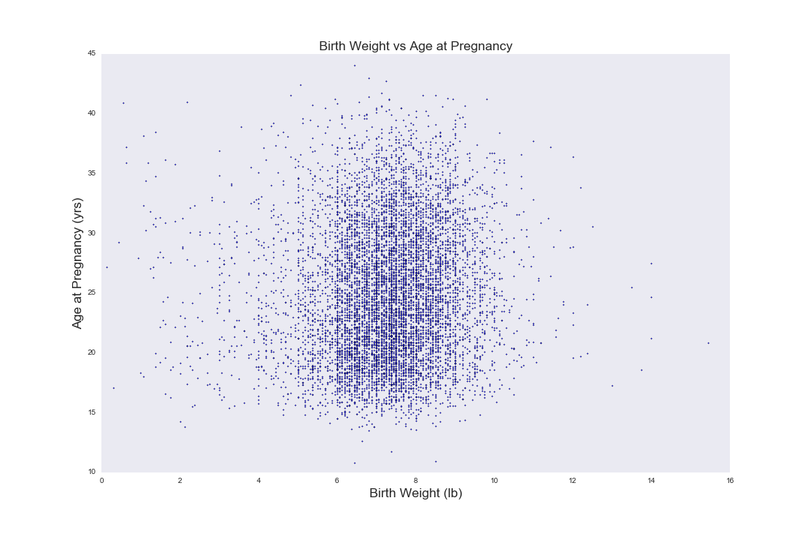

[Think Stats Chapter 7 Exercise 1](http://greenteapress.com/thinkstats2/html/thinkstats2008.html#toc70) (weight vs. age)

>> The coorilation metrics show that there is a slight coorilation between the two data sets, though they are very small. <br >
Spearman correlation: 0.0946100410966<br >
Pearson correlation: 0.0688339703541


```python
bwma = nsfg.ReadFemPreg()
bwma = bwma[['agepreg','totalwgt_lb']]
bwma.dropna(axis=0,how='any',inplace=True)
agepreg_series, birth_wgt_series = bwma['agepreg'], bwma['totalwgt_lb']

bwma = bwma.dropna(subset=['agepreg','totalwgt_lb'])
bins = np.arange(0, 17, 1)
indices = np.digitize(bwma['totalwgt_lb'], bins)
groups = bwma.groupby(indices)
cdfs = [thinkstats2.Cdf(group['agepreg']) for i, group in groups]
weights = [group['totalwgt_lb'].mean() for i, group in groups]
fig = plt.figure(figsize=[12,6])
ax = fig.add_subplot(111)
ax.set_xlabel("Birth Weight", fontsize= 'xx-large')
ax.set_ylabel("Age of Pregnacy",fontsize= 'xx-large')
ax.set_title('Percentiles',fontsize= 'xx-large')
for percent in [90,75, 50, 25]:
    ages = [cdf.Percentile(percent) for cdf in cdfs]
    label = '%dth' % percent
    ax.plot(weights, ages, label=label)
plt.legend(fontsize= 'xx-large')
plt.show()
```




```python
pearson = birth_wgt_series.corr(other = agepreg_series, method='pearson')
spearman = birth_wgt_series.corr(other = agepreg_series, method='spearman')
print('Spearman correlation: %s\nPearson correlation: %s' % (spearman,pearson))
fig = plt.figure(figsize=(15,10))
ax = fig.add_subplot(111)
ax.set_xlim(0,16)
ax.set_ylim(10,45)
ax.set_title('Birth Weight vs Age at Pregnancy', fontsize = 'xx-large')
ax.set_xlabel('Birth Weight (lb)', fontsize = 'xx-large')
ax.set_ylabel('Age at Pregnancy (yrs)', fontsize = 'xx-large')
ax.scatter(birth_wgt_series,agepreg_series,s=2)
plt.show()
```




